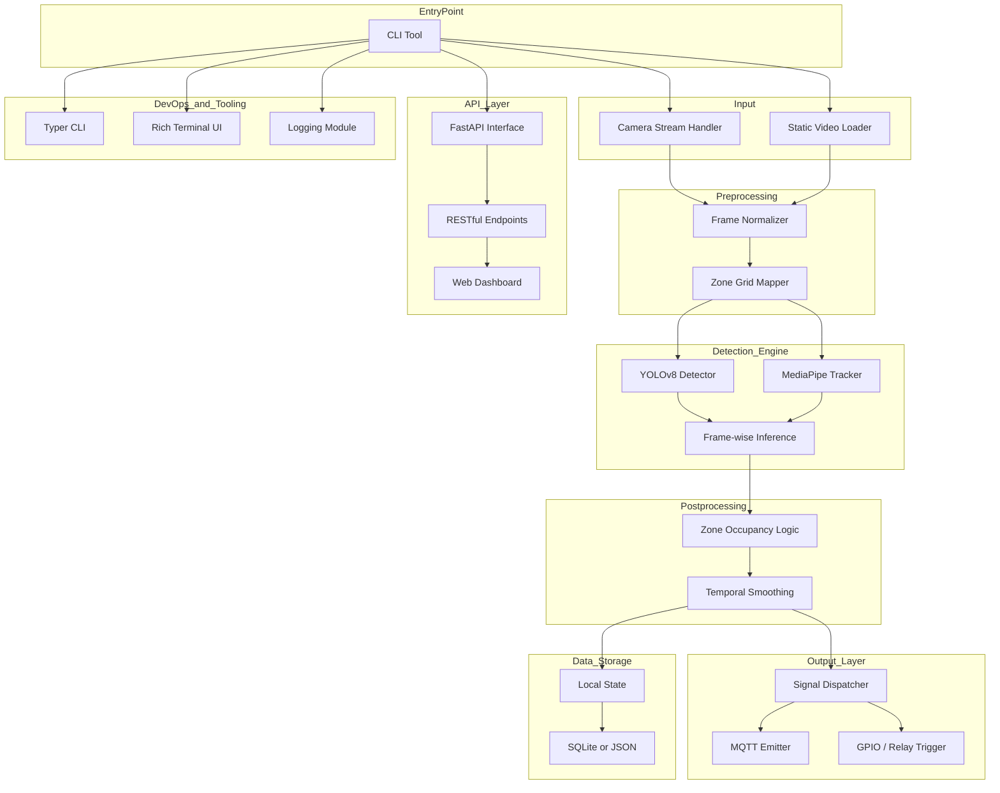

# VisionixAI – Architecture

**Zone-Based Computer Vision Automation**
Smart actions through visual presence detection.

VisionixAI is a computer vision platform for detecting presence in room zones and triggering automated responses—no sensors or hardware dependencies required.

This repository contains the complete system architecture for VisionixAI.
It includes component hierarchies, data flows, and design logic—enabling scalable, real‑world vision automation using minimal hardware and clean software abstractions.

## System Overview

Any physical space is divided into virtual grid zones. When a zone remains unoccupied for a few seconds, the system emits signals to power off devices. When a person re‑enters the zone, automation is reversed. All interactions rely solely on visual input.

The system is modular—components include a CLI, vision engine, signal dispatcher, and pluggable integration layers.

## Architecture Diagram

## Components

* **CLI Tool**
  Serves as the entry point. Accepts live camera or video input and handles runtime arguments.

* **Camera Stream / Video Input**
  Supports real‑time webcam input or static footage playback.

* **Frame Preprocessing**
  Normalizes and resizes input frames, then applies a virtual grid overlay for zone partitioning.

* **Detection Engine**
  Uses YOLOv8 for object detection and MediaPipe for tracking. Combines both to infer human presence per zone.

* **Postprocessing**
  Adds temporal smoothing to reduce noise. Triggers actions only after stable zone transitions.

* **Signal Dispatcher**
  Emits control signals via MQTT or GPIO pins. Can be extended to support WebSockets or cloud relays.

* **API Layer (Planned)**
  FastAPI interface for integration with dashboards, applications, or external triggers.

* **Data Storage**
  Optional state saving for debugging, offline logging, or visual replay (using SQLite or JSON).

* **DevOps & Tooling**

  * Typer for CLI
  * Rich for terminal UI
  * Custom logging module

## Technologies Used

* Python 3.11+
* OpenCV
* YOLOv8 (Ultralytics)
* MediaPipe
* Typer
* Rich
* FastAPI (planned)
* MQTT / GPIO (for hardware signaling)

## Status

* CLI pipeline: functional and modular
* Vision engine (YOLO + MediaPipe): working in sync
* MQTT-based signal dispatch: tested
* API interface and dashboard: pending

## License

This project is licensed under the MIT License. See `LICENSE` for details.
