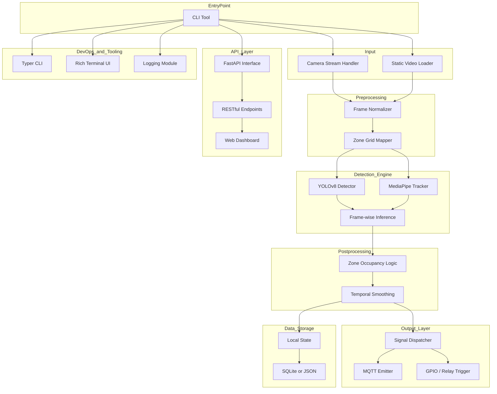

# VisionixAI

**Zone-Based Computer Vision Automation**  
Smart actions through visual presence detection—no external sensors or hardware dependencies required.

VisionixAI is a modular computer vision platform that detects human presence within predefined spatial zones and orchestrates automated responses. By leveraging high-performance visual processing, VisionixAI delivers seamless, scalable automation for smart environments—from homes to enterprise settings.

## Table of Contents

- [System Overview](#system-overview)
- [Architecture Diagram](#architecture-diagram)
- [Components](#components)
- [Technologies](#technologies)
- [Status](#status)
- [License](#license)

---

## System Overview

Any physical space is divided into virtual grid zones. When a zone remains unoccupied for a configurable duration, VisionixAI emits control signals to power off connected devices. Upon detecting a person re-entering the zone, the system reverses the automation. All interactions rely solely on visual input.

Key features:

- **Zone Partitioning**: Virtual grid overlay on frames.
- **Presence Detection**: Combines object detection (YOLOv8) and tracking (MediaPipe).
- **Noise Reduction**: Temporal smoothing to prevent false triggers.
- **Extensible Output**: MQTT, GPIO, WebSockets, or cloud relays.

---

## Architecture Diagram

---

## Components

### 1. CLI Tool
- Entry point for live camera or video input.
- Built with [Typer](https://typer.tiangolo.com) and [Rich](https://rich.readthedocs.io/) for UX.

### 2. Input Handlers
- **Camera Stream Handler**: Captures real-time webcam feed.
- **Static Video Loader**: Processes pre-recorded footage.

### 3. Frame Preprocessing
- **Frame Normalizer**: Resizes and standardizes frames.
- **Zone Grid Mapper**: Overlays a configurable grid for zone partitioning.

### 4. Detection Engine
- **YOLOv8 Detector**: High-performance object detection.
- **MediaPipe Tracker**: Robust human tracking across frames.
- Integrated inference pipeline for per-zone presence detection.

### 5. Postprocessing
- **Zone Occupancy Logic**: Determines zone transitions.
- **Temporal Smoothing**: Aggregates results to reduce noise.

### 6. Signal Dispatcher
- Emits automation signals via:
  - MQTT brokers
  - GPIO pins / Relay modules
  - Extendable for WebSockets or cloud relays

### 7. (Optional) API Layer
- Planned [FastAPI](https://fastapi.tiangolo.com/) interface for external integration and dashboards.

### 8. Data Storage
- **Local State**: In-memory state persistence.
- **Storage Backend**: SQLite or JSON for logging and replay.

### 9. DevOps & Tooling
- **CI/CD**: GitHub Actions workflows.
- **Logging**: Structured logs for debugging.

---

## Technologies

- **Language**: Python 3.11+
- **Computer Vision**: OpenCV, YOLOv8 (Ultralytics), MediaPipe
- **CLI & UX**: Typer, Rich
- **API**: FastAPI (planned)
- **Signaling**: MQTT, GPIO

---

## Status

- **CLI Pipeline**: Functional and modular.
- **Detection Engine**: YOLOv8 + MediaPipe integrated and tested.
- **Signal Dispatch**: MQTT signaling verified.
- **API & Dashboard**: In development.

---

## License

This project is licensed under the [MIT License](LICENSE).
